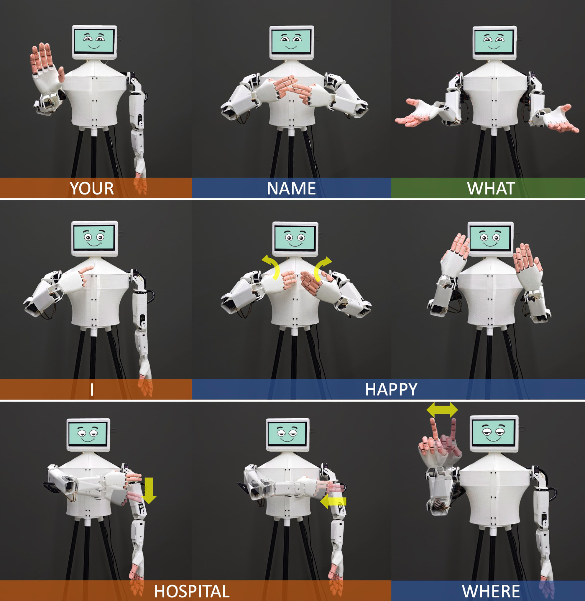
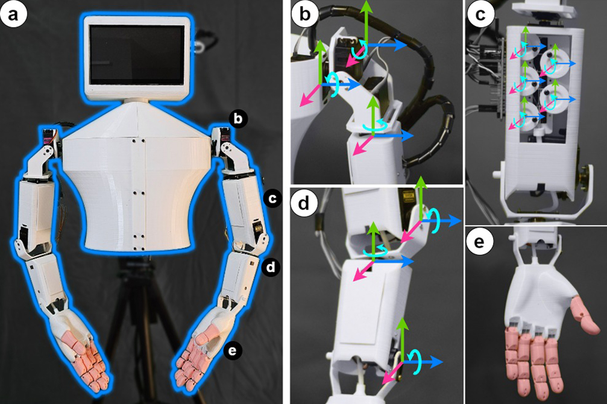
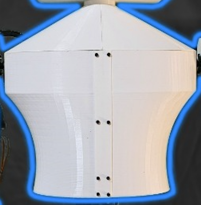
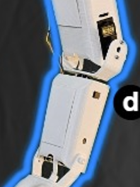
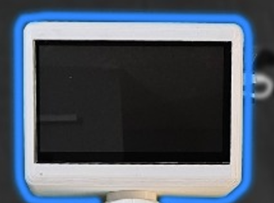
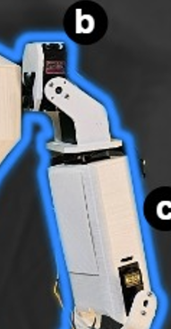
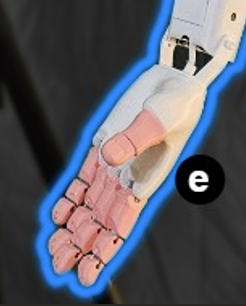
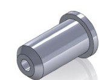
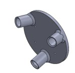

# **FABRIC**: ***FA***bricating ***B***odily-Expressive ***R***obots for ***I***nclusive and Low-***C***ost Design

## Abstract
Sign language is a vital visual-manual communication method for individuals with hearing impairments, yet current robotic systems remain expensive and technically inaccessible for embodied interaction. We present **FABRIC**, a low-cost, end-to-end toolkit that enables users to 3D print expressive robots and program bodily language through learning-from-demonstration. FABRIC supports upper-torso motion replication using video input and offers an intuitive visual programming interface, lowering barriers to designing embodied, communicative robots for diverse applications.

  

## Paper Citation
BIBTEX coming soon.

## System Overview

  

Components of the FABRIC robot:  
(a) Assembled FABRIC unit  
(b) Shoulder joints  
(c) Finger movement servos mounted inside the upper arm  
(d) Elbow and wrist joint  
(e) Robotic hand

## Design Files
<table>
  <tr>
    <td align="center">
      <a href="design_files/body">
         
        <b>Body</b>
      </a>
    </td>
    <td align="center">
      <a href="design_files/elbow">
         
        <b>Elbow</b>
      </a>
    </td>
    <td align="center">
      <a href="design_files/head">
         
        <b>Head</b>
      </a>
    </td>
    <td align="center">
      <a href="design_files/shoulder">
         
        <b>Shoulder</b>
      </a>
    </td>
  </tr>
  <tr>
    <td align="center">
      <a href="design_files/wrist+hand">
         
        <b>Wrist + Hand</b>
      </a>
    </td>
    <td align="center">
      <a href="design_files/rivets">
         
        <b>Rivets</b>
      </a>
    </td>
    <td align="center">
      <a href="design_files/stand">
         
        <b>Stand</b>
      </a>
    </td>
    <td></td>
  </tr>
</table>

## Firmware
<a href="firmware">
   
  <b>Arduino Firmware of ESP32 (UART Version)</b>
</a>

## Frontend + Backend
Will be updated soon.

## BoM and Component List

| Component                           | Quantity       | URL |
|------------------------------------|----------------|-----|
| ESP32 microcontroller              | 1              | [Link](https://www.amazon.com/s?k=ESP32+microcontroller) |
| PCA9685 Servo Driver               | 2              | [Link](https://www.amazon.com/s?k=PCA9685+Servo+Driver+module) |
| LM2596S DC-DC Converter            | 1              | [Link](https://www.amazon.com/s?k=LM2596S+DC-DC+Converter) |
| MG996R Servos (arm)                | 8              | [Link](https://www.amazon.com/s?k=MG996R+servo+motor) |
| SG90 Servos (finger/wrist)        | 14             | [Link](https://www.amazon.com/s?k=SG90+mini+servo+motor) |
| PLA Filament (~1.5 kg)            | ~1.5 kg        | [Link](https://www.amazon.com/s?k=PLA+1.75mm+3D+printer+filament) |
| TPU Filament (~0.25 kg)           | ~0.25 kg       | [Link](https://www.amazon.com/s?k=TPU+1.75mm+flexible+filament) |
| PTFE Tube                          | 1 meter        | [Link](https://www.amazon.com/s?k=PTFE+tube+1.75mm) |
| Power Adapter (12V 10A)           | 1              | [Link](https://www.amazon.com/s?k=12V+10A+DC+power+adapter) |
| Display (7" Raspberry Pi LCD)     | 1              | [Link](https://www.amazon.com/s?k=7+inch+Raspberry+Pi+LCD+touch+screen) |
| Jumper Wires, Headers             | —              | [Link](https://www.amazon.com/s?k=jumper+wires+male+to+female+kit) |
| Nylon String (Cables)             | —              | [Link](https://www.amazon.com/s?k=nylon+string+for+robotics) |
| Superglue                         | —              | [Link](https://www.amazon.com/s?k=superglue) |
| Screws, zip ties                  | —              | [Link](https://www.amazon.com/s?k=M3+screws+zip+ties+kit) |
